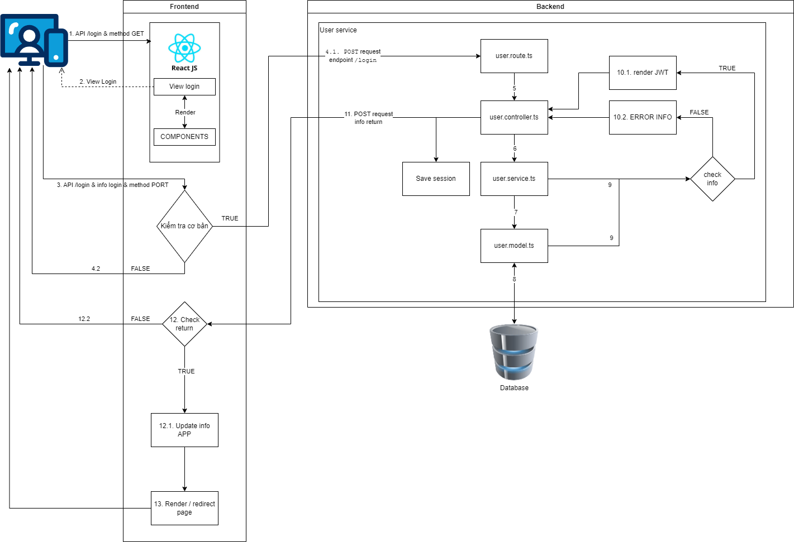

# System Operating Flow Description

Hệ thống được thiết kế theo kiến trúc module hóa sử dụng **React** (Frontend) và **Node.js** (Backend) với **TypeScript** nhằm đảm bảo kiểm tra kiểu dữ liệu mạnh (strong type checking) và khả năng mở rộng (scalability). Dưới đây là mô tả chi tiết cách hệ thống hoạt động từ quá trình tương tác của người dùng đến khi backend xử lý và trả kết quả.

## 1. Frontend Interaction (React)

- Khi người dùng truy cập vào ứng dụng web, React sẽ render giao diện dựa trên các component được cấu trúc sẵn.

- `Redux` hoặc `Context API` quản lý trạng thái của ứng dụng, đảm bảo tính nhất quán giữa các component.

- Mọi hành động người dùng (đăng nhập, lấy dữ liệu xét nghiệm, quản lý vai trò,...) đều kích hoạt các request API gửi đến backend.

## 2. Backend Request Handling (Node.js | Next.js)

- Server backend nhận các request API thông qua các route đã được định nghĩa sẵn. Các route này được tổ chức theo loại hành động, chẳng hạn như `user.route.ts`, `role.route.ts`, hoặc `test.routes.ts`.

- `Request` sẽ được chuyển tới `route` tương ứng, sau đó tiếp tục tới `controller`.

- `Controller` gọi đến `service`, nơi chứa logic xử lý.

- `Service` sẽ truy cập vào `Database` thông qua `model` để lấy thông tin cần thiết.

- `Controller` sẽ gửi phản hồi (bao gồm token JWT) trở lại `frontend`.

## 3. Frontend Update & UI Rendering

- Sau khi nhận được phản hồi từ backend, React chuyển hướng hoặc render thông tin phù hợp. Giao diện sẽ được cập nhật một cách động.

## 4. Frontend Update & UI Rendering

- Khi nhận được phản hồi JSON từ backend, frontend sẽ xử lý dữ liệu.

  - **Đăng nhập thành công**: Token sẽ được lưu (ví dụ: trong `localStorage` hoặc `sessionStorage`), và người dùng sẽ được chuyển hướng tới trang tương ứng.

  - Yêu cầu lấy dữ liệu: Dữ liệu sẽ được lưu vào **Redux | Context API** để cập nhật trạng thái của ứng dụng.

- Các component React sẽ được render lại một cách động dựa trên trạng thái mới.

  - Ví dụ, khi người dùng đăng nhập thành công, hệ thống có thể hiển thị các tùy chọn điều hướng khác nhau, hoặc nếu kết quả xét nghiệm được lấy, chúng sẽ được hiển thị trên giao diện.

## 5. Request Processing Flow

1. `Routes`: Request đầu tiên sẽ đến route tương ứng. Mỗi file route sẽ định nghĩa các endpoint HTTP khác nhau (như POST, GET) để ánh xạ đến các hành động khác nhau.

2. `Controllers`: Từ route, request được chuyển tiếp đến **controller** thích hợp. Controllers chịu trách nhiệm điều phối việc xử lý các request bằng cách gọi đến các service phù hợp và quản lý logic phản hồi.

3. `Services`: Controllers ủy thác logic nghiệp vụ cho các **service**, nơi chứa chức năng cốt lõi của hệ thống. Service tương tác với repository, thực hiện các quy tắc nghiệp vụ và các phép tính phức tạp.

4. `Models & Repositories`: Khi tương tác với `database`, các service gọi đến models để giao tiếp với `database`. Các models định nghĩa cấu trúc của các đối tượng dữ liệu như `User`, `Role`, và `Permission`.

5. `Response`: Sau khi xử lý request (ví dụ, xác thực đăng nhập), controller sẽ gửi phản hồi dưới dạng **JSON** trở lại frontend.

## 6. Example Flow: User Login

- **Login flow diagram**

1. **Hành động của người dùng (Frontend):**

   - Người dùng truy cập vào trang đăng nhập (`auth/login`), React tải component để xử lý việc nhập thông tin đăng nhập.

   - Người dùng nhập thông tin đăng nhập và nhấn nút "Login" trên giao diện frontend. Hành động này kích hoạt một function Kiểm tra thông tin nhập:
     - **Thông tin đúng**: Gửi POST request tới API backend (`/login`).
     - **Thông tin sai**: Hiển thị thông báo lỗi cho người dùng.

2. **Xử lý Request trên Backend:**

   - Request `POST /login` sẽ được định tuyến tới handler xử lý đăng nhập trong `user.route.ts`, sẽ chuyển tiếp request đến `user.controller.ts`.

   - `user.service.ts`: Nơi chứa logic liên quan đến người dùng (xác minh thông tin đăng nhập). Sẽ truy cập vào `Database` thông qua `user.model.ts` để xác minh thông tin đăng nhập.

     - Nếu thông tin đăng nhập chính xác, `service` sẽ tạo một `JWT` (JSON Web Token) và gửi nó trở lại cho `controller`.

   - `Controller` sẽ gửi phản hồi trở lại `frontend`.
     - Đối với việc đăng nhập thành công, phản hồi có thể bao gồm một `token JWT` mà frontend có thể lưu lại để duy trì phiên làm việc của người dùng.
     - Nếu đăng nhập không thành công, phản hồi lại thông báo cho người dùng về phía frontend.

3. **Cập nhật trên Frontend:**

- Khi nhận được phản hồi, frontend sẽ kiểm tra thông tin phản hồi:

  - **Thành công**: Lưu `token JWT` (thường là trong `localStorage` hoặc `sessionStorage`) và cập nhật trạng thái ứng dụng để phản ánh rằng người dùng đã đăng nhập. Giao diện sẽ thay đổi cho phép truy cập các chức năng bảo mật.
  - **Thất bại**: Hiển thị thông báo lỗi cho người dùng.
